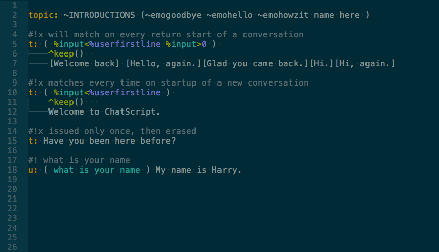

# README #

### Summary ###

A [ChatScript 6.5b](https://github.com/bwilcox-1234/ChatScript) syntax definition. :cake:

**_June 2016_**
**_v0.9.2_**

I use Monokai as my ST color scheme, but it should look fine with others as well.

### Monokai

### Solarized

### Install
Install through [Package Control](https://packagecontrol.io/installation):
  * `CTRL+SHIFT+P`, _Install..._, `ENTER`
  * Search for _ChatScript syntax_, `ENTER`
  * That' it. And you'll get the updates too!

### Contribute
* Clone the repo into your `/Application Support/Sublime Text 3/Packages/User` for easy testing
* Install the PackageDev in Sublime Text
* Make your changes in the the JSON or YAML tmLanguage file
* Compile the file into a property list with `CTRL+B`
* Make sure that both JSON and YAML are identical by building both
* Pull request!

### Refs
http://www.apeth.com/nonblog/stories/textmatebundle.html
http://docs.sublimetext.info/en/latest/extensibility/syntaxdefs.html  
http://manual.macromates.com/en/language_grammars  
http://chatscript.sourceforge.net/Documentation/  
http://tmtheme-editor.herokuapp.com/#/theme/Monokai  
http://www.lablablab.net/en/about/  
